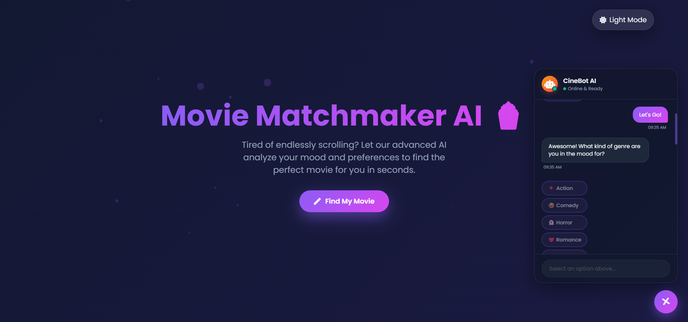

# 🍿 Movie Matchmaker AI

> 🚀 An intelligent movie recommendation chatbot that suggests the perfect movie based on your **mood, genre, and language preferences**.

---

## 🌐 Live Demo

👉 **Try it here:**
🔗 [https://movie-prediction-brown.vercel.app](https://movie-prediction-brown.vercel.app)

---

## 📌 Overview

Movie Matchmaker AI is a beautifully designed **interactive web application** that eliminates endless scrolling by helping users quickly discover movies tailored to their current mood and preferences.

With a conversational chatbot interface and a smart scoring algorithm, the system delivers **highly relevant movie recommendations in seconds**.

---

## ✨ Features

* 🤖 Interactive Chatbot UI
* 🎯 Smart Recommendation Algorithm
* 🎭 Mood-Based Movie Suggestions
* 🎬 Genre Filtering (Action, Comedy, Horror, Romance, Sci-Fi)
* 🌍 Language Support (English & Hindi)
* 🌗 Light / Dark Mode Toggle
* 🎨 Modern Glassmorphism Design
* ⚡ Smooth Animations & Particle Effects
* 📱 Fully Responsive (Mobile + Desktop)

---

## 🧠 How It Works

The recommendation system uses a **weighted scoring mechanism**:

| Preference        | Score |
| ----------------- | ----- |
| 🎬 Genre Match    | +3    |
| 🌍 Language Match | +2    |
| 😊 Mood Match     | +1    |

👉 Movies are ranked based on total score
👉 Top 3 best matches are displayed to the user

---

## 💡 User Flow

1. User clicks **"Find My Movie"** 🎬
2. Chatbot asks for:

   * Genre
   * Language
   * Mood
3. System analyzes preferences
4. 🎯 Displays best movie recommendations

---

## 🛠️ Tech Stack

* **Frontend:** HTML5, CSS3, JavaScript
* **Styling:** Glassmorphism + Animations
* **Icons:** Font Awesome
* **Fonts:** Google Fonts (Poppins)
* **Deployment:** Vercel

---

## 📂 Project Structure

```
📁 movie-matchmaker-ai
│── index.html      # Main application file
│── README.md       # Documentation
```

---

## 🚀 Getting Started

### 1️⃣ Clone the Repository

```bash
git clone https://github.com/your-username/movie-matchmaker-ai.git
```

### 2️⃣ Open the Project

Simply open:

```bash
index.html
```

✅ No installation required
✅ No dependencies

---

## 📸 Screenshots

> ⚠️ Add screenshots here for better presentation

Example:

```

```

---

## 🔮 Future Enhancements

* 🎥 YouTube Trailer Integration
* ⭐ Ratings & Reviews System
* 🤖 AI/ML-Based Recommendation Model
* 🌐 Backend Integration (Node.js / Python)
* 📊 User Preference Tracking
* 🔍 Search Functionality

---

## 👨‍💻 Author

**Daksh Khandelwal** 🚀
💡 AI | Web Development | Data Science

---

## 🌟 Support

If you found this project useful:

⭐ Star this repository
🍴 Fork it
📢 Share it with others

---

## 📜 License

This project is open-source and available under the **MIT License**.

---

## 🔥 Final Note

> Built with passion to make movie discovery smarter, faster, and more fun 🎬✨
